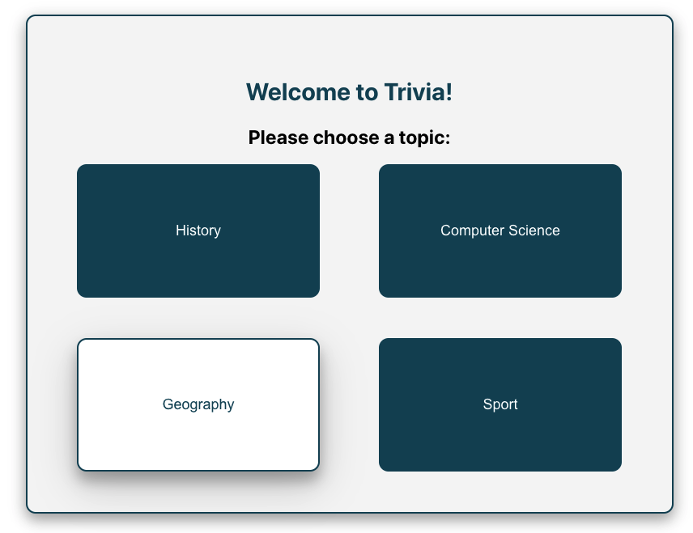
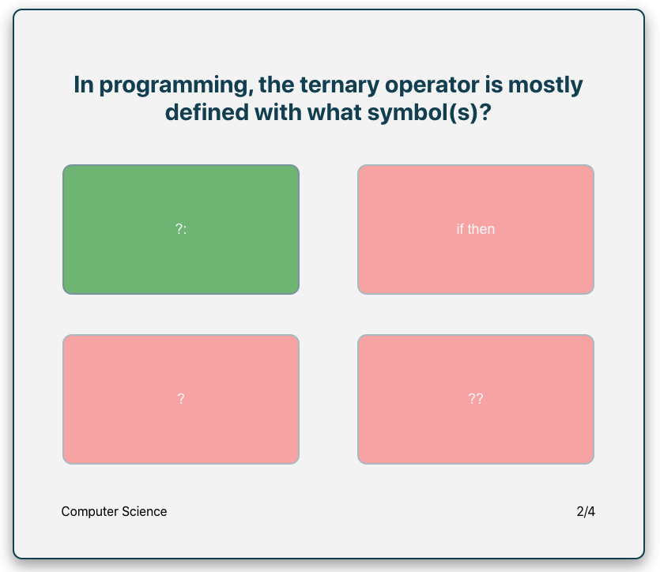

# History Trivia

## Introduction
This project has been a great opportunity to improve my skills working with React. By sourcing the trivia questions from the Open Trivia DB API, I have been able to focus on working with React to create a reactive, smooth playing experience on the front end.

## Technologies Used

* React Hooks and Context API
* React Router DOM
* Axios API Requests
* Promise Chaining
* CSS

## Interesting Challenges

This project allowed me to practise working with asynchronous functions and promise chaining. The two occasions upon which I was required to navigate asynchronicity were when initializing the game by getting questions from the Open Trivia API, and when displaying the correct answer for two seconds each round after the user submits their guess. On both occasions I decided to use arrow function promise chaining syntax rather than async/await syntax, but I tested both to make sure that I was comfortable with their use. 

I also needed to think carefully about how I wanted to manipulate the input from the API in order to eventually display the questions to the user. I decided to place all of the possible answers in a single array as objects, with one key-value pair providing the text content of the answer, and the other noting if that particular answer was correct or incorrect. In order to create a viable user experience, I then needed to shuffle the order of the array so that the correct answer wasn't always in the same place when the answers were mapped on to buttons. I used the shuffle function in the lodash library to achieve this. 

The API data also originally provided strings containing lots of html entities (e.g. &# 39; instead of an apostrophe), which I needed to decode using the 'he' library so that the user would see regular text characters.

## Future Code Improvements

Currently, the app runs entirely on the client side, which has the massive downside that anyone using Google Chrome with the React Devtools plugin can just look at the button components to find out which answer is correct. This could be addressed by creating a custom http server to interact with the Open Trivia API and my React App, meaning that this information would not be available on the client side.

Although the html entities have been largely decoded by the 'he', there is some kind of bug which means that occasionally the app displays an html entity rather than the corresponding character. 

I would also love to create 'top scores' tables for each category, so that if the user achieves a high score they could input their name and claim bragging rights on the table. This would involve creating some simple SQL tables, and then using the http server to mediate reading from and writing to these tables.

Another interesting extension to the current app would be to create a countdown timer for each question, which forces the user to answer in a restricted period of time. Potentially, the user could then score bonus points if they answered the question quickly.